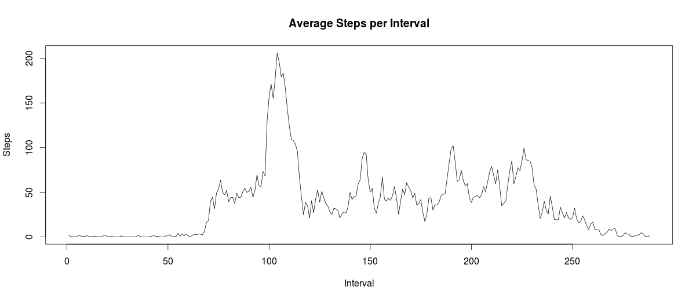

# Reproducible Research: Peer Assessment 1


## Loading and preprocessing the data

### Load the activity data
Extract the zip file on your OS and load the data file 'activity.csv' in R.


```r
dat <- read.csv("activity.csv", sep = ",", header = TRUE)
```

### Process the data
Factor the 'date' field for further analysis.


```r
dat <- transform(dat, date = factor(date))
```


## What is mean total number of steps taken per day?

### Histogram of the total number of steps taken each day

```r
library(ggplot2)
steps.per.day <- tapply(dat$steps, dat$date, sum, na.rm = TRUE)
steps <- data.frame(steps.per.day, names(steps.per.day))
hist(steps$steps.per.day, breaks = length(steps.per.day), xlab = " Number of Steps Each Day", main = "Histogram of Steps Taken Each Day")
```

 

---

---

###  Mean and median total number of steps taken per day

```r
mu <- mean(steps.per.day, na.rm = TRUE)
median <- median(steps.per.day, na.rm = TRUE)
```
Mean of total number of steps taken per day is **9354.2295**.

Median of total numnber of steps taken per day is **10395**.


## What is the average daily activity pattern?

### Average Steps taken for each interval across all days

```r
dat <- transform(dat, interval = ordered(as.numeric(interval)))
avg.steps.per.interval <- tapply(dat$steps, dat$interval, mean, na.rm = TRUE)
avg.steps <- data.frame(steps = avg.steps.per.interval, interval = as.numeric(names(avg.steps.per.interval)))
plot(x = avg.steps$interval, y = avg.steps$steps, type = "l", xlab = "Interval", ylab = "Steps", main = "Average Steps per Interval")
```

 

---

---

### Overall Maximum Steps Interval Identifier

```r
interval.id <- avg.steps[which.max(avg.steps$steps), 2]
```
Id **835** is the 5-minute interval id, on average across all the days in the dataset, which contains the maximum number of steps.

## Imputing missing values

```r
missing.values <- sum(is.na(dat))
```
There are **2304** missing values in the dataset.

###Strategy to fill missing values
We will fill the missing values with the mean of number of steps taken on that day.


```r
dat1 <- read.csv("activity.csv", header=TRUE)
na.index <- which(is.na(dat1$steps))
avg.per.day <- tapply(dat$steps, dat$date, mean, na.rm = TRUE)
dat1$steps[na.index] <- avg.per.day[dat1$date[na.index]]
```

## Are there differences in activity patterns between weekdays and weekends?

